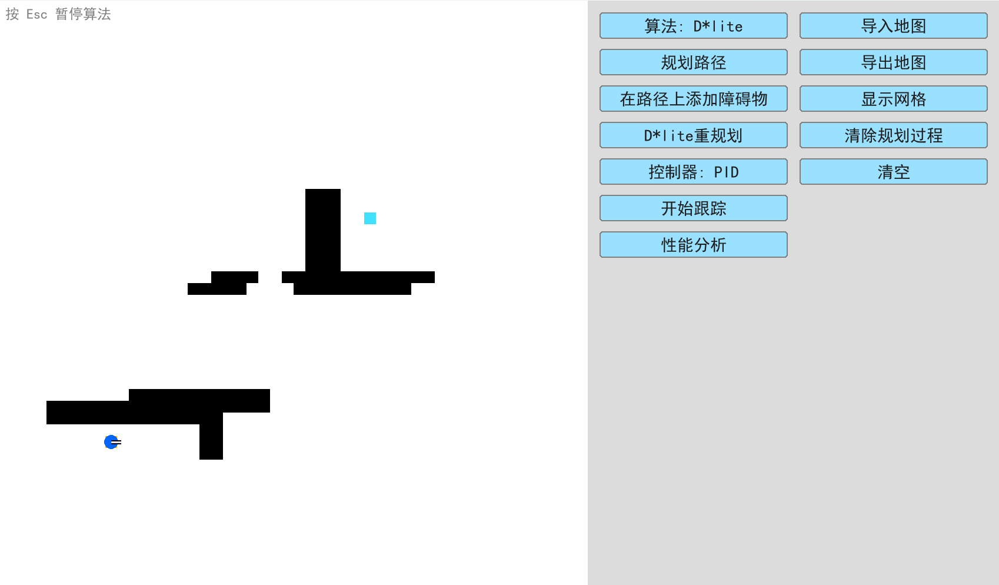
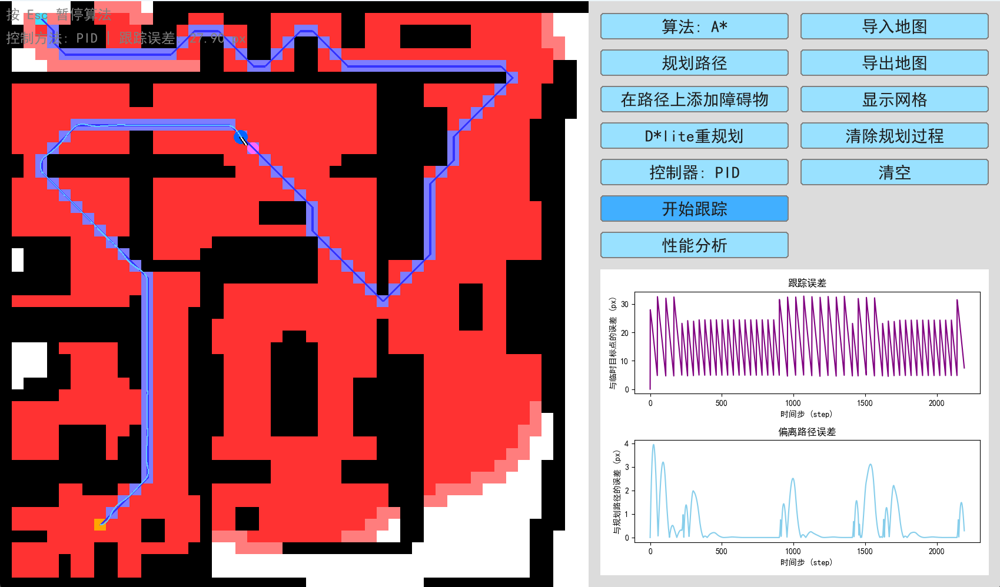
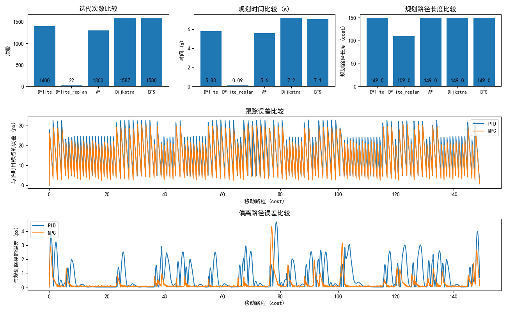

# 机器人路径规划与跟踪系统

## 项目概述

本项目实现了一个完整的机器人路径规划与跟踪系统，采用模块化设计，提供多种路径规划算法和控制方法。系统支持动态环境交互，可实时修改障碍物并触发重规划，适用于机器人导航及动态重规划避障的模拟与可视化。项目包含以下核心功能：

1. **路径规划**：提供 4 种规划算法（D* Lite、（D* Lite 重规划）、A\*、Dijkstra、BFS）
2. **路径跟踪**：支持 2 种控制方法（PID、MPC）
3. **动态环境交互**：进行跟踪时可实时添加/删除障碍物并自动触发重规划更新路线
4. **性能分析**：记录并展示各算法性能指标
5. **机器人建模**：三轮差分驱动模型（后两轮差分驱动，前一轮控制朝向）
6. **可视化与存档**：系统采用栅格地图表示环境，支持地图导入/导出，提供直观的可视化界面展示路径规划过程与机器人运动过程。
7. **噪声模拟与过滤**：机器人可添加运动噪声与卡尔曼滤波

## 项目结构

```
├── main.py                         # 主运行程序（入口文件）
├── control.py                      # PID和MPC控制算法实现
├── visualization.py                # 可视化相关类与函数
├── path_planning.py                # 路径规划算法实现
├── robot_model_with_noise.py       # 带噪声的机器人模型（含卡尔曼滤波类）
├── robot_model_without_noise.py    # 无噪声的机器人模型
├── requirements.txt                # 项目依赖列表
├── grid_save_incline.json          # 默认地图配置文件（简单地图）
├── grid_save_incline_simple.json   # 地图文件（简单地图）
└── grid_save_incline_complex.json  # 地图文件（复杂地图）
```

## 安装与运行

### 环境要求

- Python 3.10 或更高版本

### Requirements

- matplotlib == 3.9.2
- numpy == 1.26.4
- pygame == 2.6.1
- scipy == 1.13.1
- setuptools <= 75.1.0

### 依赖安装

```bash
pip install -r requirements.txt
```

### 运行方式

```bash
python main.py [-h] [-f FILE] [--noise]
```

**可选参数**:

- `-f FILE, --file FILE`: 指定地图 JSON 文件（默认为 grid_save_incline.json）
- `--noise`: 启用机器人运动噪声（默认禁用）
- `-h, --help`: 显示帮助信息

```bash
# 基本运行（使用默认地图，无噪声）
python main.py

# 使用自定义地图（存档与读取）
python main.py -f custom_map.json

# 启用运动噪声和卡尔曼滤波
python main.py --noise
```

## 功能说明

### 界面与交互

<!-- _图：初始界面_

 -->

_图：导入简单地图后的界面_



- **机器人表示**：
  - 蓝色圆形：机器人当前位置
  - 黑白指针：机器人当前朝向
- **白色区域**：可通行区域
- **黑色区域**：障碍物
- **灰色区域**：在路径上随机添加的障碍物（通过按钮触发）
- **紫色圆形**：跟踪时的临时目标点

### 地图交互操作

| 操作         | 功能                                     |
| ------------ | ---------------------------------------- |
| **左键点击** | 添加障碍物（未设起终点时优先设置起终点） |
| **右键点击** | 删除障碍物                               |
| **左键长按** | 连续添加障碍物                           |
| **右键长按** | 连续删除障碍物                           |
| **ESC 键**   | 终止当前运行的算法                       |

### 控制按钮

| 按钮                   | 功能                                                                                                     |
| ---------------------- | -------------------------------------------------------------------------------------------------------- |
| **算法：**             | 循环切换规划算法（D*lite → A* → Dijkstra → BFS → D\*lite）                                               |
| **规划路径**           | 执行当前选择的路径规划算法                                                                               |
| **在路径上添加障碍物** | 在规划路径上随机添加几个障碍物                                                                           |
| **D\*lite 重规划**     | 执行 D\*lite 重规划（需先运行 D\*lite），期间可以添加、删除障碍物、*改变起点*或者无操作                  |
| **控制器：**           | 循环切换控制方法（PID ↔ MPC）                                                                            |
| **开始跟踪**           | robot 对最新一次规划的路径进行跟踪                                                                       |
| **性能分析**           | 显示每个路径规划算法的迭代次数、规划时间、规划路径长度，以及每个路径跟踪算法的跟踪误差以及偏离路径误差。 |
| **导入地图**           | 从文件加载地图                                                                                           |
| **导出地图**           | 保存当前地图到文件                                                                                       |
| **显示网格**           | 切换栅格网格显示                                                                                         |
| **清除规划过程**       | 初始化用于可视化路径规划过程的栅格及其数据                                                               |
| **清空**               | 初始化所有栅格及其数据                                                                                   |

_图：运行算法界面_



## 算法说明

### 路径规划算法

1. **D\* Lite**：增量式启发式搜索算法，支持动态环境重规划
2. **D\* Lite 重规划**：D\* Lite 的动态重规划，保留上一次迭代的地图信息以减少因环境变动而重新规划的计算量
3. **A\***：启发式搜索算法，适合静态环境
4. **Dijkstra**：无启发式的最短路径算法
5. **BFS**：广度优先搜索算法

### 路径跟踪算法

1. **PID 控制**：比例-积分-微分控制器，反馈控制
2. **MPC 控制**：模型预测控制器，预测优化

### 机器人模型

采用三轮差分驱动模型：

- **后两轮**：独立驱动的动力轮
- **前一轮**：控制朝向的转向轮

提供两种实现版本：

1. `robot_model_with_noise.py`：包含运动噪声和卡尔曼滤波，噪声包括固定的轮子朝向偏移与随机的移动和转向噪声
2. `robot_model_without_noise.py`：理想无噪声模型

## 性能分析

点击"性能分析"按钮可查看以下指标：

- **规划算法指标**：
  - 迭代次数
  - 规划时间(ms)
  - 规划路径长度
- **跟踪算法指标**：
  - 跟踪误差比较：与临时目标点的误差
  - 偏离路径误差比较：与规划路径的误差

## 注意事项

1. 控制台会输出初始化信息、相应的交互提示和算法结果
2. 如果规划算法采用的是 D\*lite，那么在运行跟踪算法的过程中支持动态修改环境：
   - 可中途添加/删除障碍物，程序会*自动运行*"D\*lite 重规划"算法以继续进行跟踪，便于直观可视化 D\*lite 动态路径规划的时效性与灵活性
   - 支持左键/右键长按操作以连续添加/删除障碍物
3. 按 Esc 快捷键可以终止正在运行的路径规划和路径跟踪算法
4. 地图默认障碍物体积已经膨胀了 1 到 2 个机器人直径
5. 性能分析数据取自各算法最后一次运行结果（初始为空）
6. 考虑到不同设备的计算性能差异，动态可视化为仅变化部分局部更新。部分算法可视化画面设置为隔几帧更新，可根据实际情况调节

## 性能分析示例

_图：性能分析界面_



## License

- This project is licensed under the terms of the MIT license. See the [LICENSE](LICENSE.md) file for license rights and limitations (MIT).

## Comments

- Any comments for the codes are always welcome.
